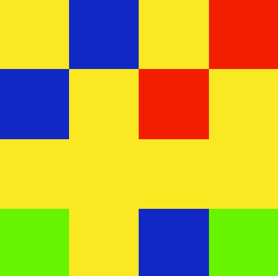

# MemoryGame

This is the first game I ever published after learning Unreal Engine
It is a simple memory game.

- Originally made Unreal Engine 4 in August 2022
- Remade in Godot in October 2025

## Changelogs

Full changelogs

1.0.0 Base Game

Added A grid of 16 pixels with randomly assigned colours

Made it so after 10 seconds the grid goes grey and a random pixel goes white

Made it so if the user clicks the correct button the score goes up

Made Game over screen with a highscore counter

Made Main Menu and how to play screen

1.1.0 Game modes

Added 2 New game modes

Easy Mode 4 Pixels

Hard Mode 25 Pixels

Moved Main menu to a seperate file

Made it so the program tells you which was the correct colour if you get it wrong

1.1.1 Bug fix

Fixed a bug where the mouse cursor doesn't show on main menu

1.2.0 Highscore saving and loading system

Added Save Function

Added Load Function

Added Trigger to save highscore as soon as you achieve it

Added load feature that triggers when opening the game or returning to main menu

1.3.0

Reworked entire user interface

Added buttons for navigation on main menu screen

Added New pages: Play, Highscores, How to play, Credits

Added a external link on the credits page for contacting

Recoloured buttons from white to theme colours

2.0.0

- Remade the game in Godot keeping the same features

The game is now finished any further updates will be bug fixes unless i ever decide to do more to this game
